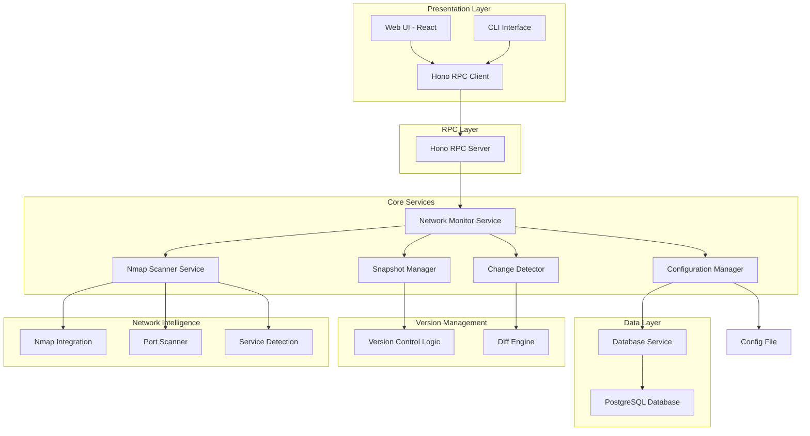

# Design Document

## Overview

The LAN Network Monitor is a Node.js + TypeScript application that provides continuous monitoring of local area network devices with a comprehensive web-based UI. The system uses a modular architecture with clear separation of concerns, implementing advanced network discovery using nmap, change detection with version-like snapshots, data persistence, and a rich graphical interface.

The application follows a scheduled monitoring pattern where detailed network scans are performed at regular intervals, results are compared with previous states using snapshot-based versioning, and changes are recorded persistently. The web UI provides graphical visualization of network topology, device details, port information, and diff-based change tracking. The design emphasizes reliability, configurability, maintainability, and comprehensive network intelligence gathering.

## Architecture

The system follows a layered architecture pattern with web UI and advanced scanning capabilities:



### Key Architectural Decisions

1. **PostgreSQL Database**: Chosen for robust data integrity, advanced querying capabilities, and excellent performance for time-series network data
2. **Nmap Integration**: Uses nmap for comprehensive network scanning including port detection, service identification, and OS fingerprinting
3. **Snapshot-based Versioning**: Implements version control-like functionality for network state tracking and diff visualization
4. **Modern React Stack**: Vite + TanStack Router + TanStack Query + Zustand + shadcn/ui + Tailwind CSS for rich UI
5. **Hono RPC**: Type-safe RPC communication between frontend and backend using Hono's RPC capabilities
6. **Function-based Architecture**: Emphasizes functional programming patterns over class-based approaches
7. **Scheduled Scanning**: Uses Node.js timers rather than cron for better control and error handling
8. **Modular Design**: Each component has a single responsibility and clear interfaces
9. **TypeScript**: Provides type safety and better development experience
10. **Configuration-driven**: All monitoring parameters are externally configurable

## Components and Interfaces

### NetworkMonitorService
**Purpose**: Main orchestrator that coordinates scanning, change detection, and scheduling

```typescript
// Function-based service implementation
export const createNetworkMonitorService = (
  config: MonitorConfig,
  scanner: NmapScannerService,
  snapshotManager: SnapshotManager,
  changeDetector: ChangeDetector
) => {
  let isRunning = false
  let scanInterval: NodeJS.Timeout | null = null
  
  const start = async (): Promise<void> => {
    // Implementation
  }
  
  const stop = async (): Promise<void> => {
    // Implementation
  }
  
  const performScan = async (): Promise<ScanResult> => {
    // Implementation
  }
  
  const getNetworkStatus = async (): Promise<NetworkStatus> => {
    // Implementation
  }
  
  const getNetworkHistory = async (timeRange?: TimeRange): Promise<NetworkChange[]> => {
    // Implementation
  }
  
  return {
    start,
    stop,
    performScan,
    getNetworkStatus,
    getNetworkHistory,
    isRunning: () => isRunning
  }
}

export type NetworkMonitorService = ReturnType<typeof createNetworkMonitorService>
```

### NmapScannerService
**Purpose**: Handles comprehensive device discovery and network scanning using nmap

```typescript
// Function-based scanner service
export const createNmapScannerService = (config: MonitorConfig['nmap']) => {
  const scanNetwork = async (scanConfig: ScanConfig): Promise<Device[]> => {
    // Implementation using functional approach
  }
  
  const scanDevice = async (ip: string): Promise<Device | null> => {
    // Implementation
  }
  
  const scanPorts = async (ip: string, portRange?: string): Promise<Port[]> => {
    // Implementation
  }
  
  const detectServices = async (ip: string): Promise<Service[]> => {
    // Implementation
  }
  
  const validateNetworkRange = (range: string): boolean => {
    // Pure function implementation
  }
  
  const parseNmapOutput = (xmlOutput: string): Device[] => {
    // Pure function for parsing nmap XML
  }
  
  const executeNmapCommand = async (args: string[]): Promise<string> => {
    // Command execution with error handling
  }
  
  return {
    scanNetwork,
    scanDevice,
    scanPorts,
    detectServices,
    validateNetworkRange,
    parseNmapOutput,
    executeNmapCommand
  }
}

export type NmapScannerService = ReturnType<typeof createNmapScannerService>

interface Device {
  ip: string
  mac: string
  hostname?: string
  vendor?: string
  osInfo?: OSInfo
  responseTime?: number
  ports: Port[]
  services: Service[]
  lastSeen: Date
  isActive: boolean
}

interface Port {
  number: number
  protocol: 'tcp' | 'udp'
  state: 'open' | 'closed' | 'filtered'
  service?: string
  version?: string
  product?: string
}

interface Service {
  port: number
  name: string
  product?: string
  version?: string
  extraInfo?: string
  confidence: number
}

interface OSInfo {
  name?: string
  family?: string
  generation?: string
  type?: string
  vendor?: string
  accuracy: number
}
```

### SnapshotManager
**Purpose**: Manages network state snapshots for version-like tracking

```typescript
// Function-based snapshot manager
export const createSnapshotManager = (databaseService: DatabaseService) => {
  const createSnapshot = async (devices: Device[]): Promise<NetworkSnapshot> => {
    const snapshot: NetworkSnapshot = {
      id: crypto.randomUUID(),
      timestamp: new Date(),
      deviceCount: devices.length,
      totalPorts: devices.reduce((sum, device) => sum + device.ports.length, 0),
      checksum: await calculateChecksum(devices),
      devices,
      metadata: {
        scanDuration: 0,
        scanType: 'comprehensive',
        errors: []
      }
    }
    
    await databaseService.saveSnapshot(snapshot)
    return snapshot
  }
  
  const getSnapshot = async (snapshotId: string): Promise<NetworkSnapshot> => {
    return await databaseService.getSnapshot(snapshotId)
  }
  
  const listSnapshots = async (timeRange?: TimeRange): Promise<NetworkSnapshot[]> => {
    return await databaseService.listSnapshots(timeRange)
  }
  
  const compareSnapshots = async (snapshot1: string, snapshot2: string): Promise<SnapshotDiff> => {
    const [snap1, snap2] = await Promise.all([
      getSnapshot(snapshot1),
      getSnapshot(snapshot2)
    ])
    
    return generateSnapshotDiff(snap1, snap2)
  }
  
  return {
    createSnapshot,
    getSnapshot,
    listSnapshots,
    compareSnapshots
  }
}

// Pure functions for snapshot operations
export const calculateChecksum = async (devices: Device[]): Promise<string> => {
  // Pure function to calculate snapshot checksum
}

export const generateSnapshotDiff = (snapshot1: NetworkSnapshot, snapshot2: NetworkSnapshot): SnapshotDiff => {
  // Pure function to generate diff between snapshots
}

export type SnapshotManager = ReturnType<typeof createSnapshotManager>

interface NetworkSnapshot {
  id: string
  timestamp: Date
  deviceCount: number
  totalPorts: number
  checksum: string
  devices: Device[]
  metadata: {
    scanDuration: number
    scanType: string
    errors: string[]
  }
}

### ChangeDetector
**Purpose**: Compares snapshots and generates detailed diffs

```typescript
// Function-based change detector - all pure functions
export const detectChanges = (current: NetworkSnapshot, previous: NetworkSnapshot): SnapshotDiff => {
  const deviceChanges = generateDeviceChanges(current.devices, previous.devices)
  const summary = calculateDiffSummary(deviceChanges)
  
  return {
    fromSnapshot: previous.id,
    toSnapshot: current.id,
    timestamp: new Date(),
    summary,
    deviceChanges
  }
}

export const generateDeviceChanges = (currentDevices: Device[], previousDevices: Device[]): DeviceDiff[] => {
  const changes: DeviceDiff[] = []
  const previousDeviceMap = new Map(previousDevices.map(d => [d.ip, d]))
  const currentDeviceMap = new Map(currentDevices.map(d => [d.ip, d]))
  
  // Detect added devices
  for (const device of currentDevices) {
    if (!previousDeviceMap.has(device.ip)) {
      changes.push({
        deviceIp: device.ip,
        changeType: ChangeType.DEVICE_JOINED,
        deviceAdded: device,
        portChanges: [],
        serviceChanges: [],
        propertyChanges: []
      })
    }
  }
  
  // Detect removed devices
  for (const device of previousDevices) {
    if (!currentDeviceMap.has(device.ip)) {
      changes.push({
        deviceIp: device.ip,
        changeType: ChangeType.DEVICE_LEFT,
        deviceRemoved: device,
        portChanges: [],
        serviceChanges: [],
        propertyChanges: []
      })
    }
  }
  
  // Detect changed devices
  for (const currentDevice of currentDevices) {
    const previousDevice = previousDeviceMap.get(currentDevice.ip)
    if (previousDevice) {
      const deviceDiff = generateDeviceDiff(currentDevice, previousDevice)
      if (deviceDiff.portChanges.length > 0 || deviceDiff.serviceChanges.length > 0 || deviceDiff.propertyChanges.length > 0) {
        changes.push(deviceDiff)
      }
    }
  }
  
  return changes
}

export const generateDeviceDiff = (currentDevice: Device, previousDevice: Device): DeviceDiff => {
  const portChanges = detectPortChanges(currentDevice.ports, previousDevice.ports)
  const serviceChanges = detectServiceChanges(currentDevice.services, previousDevice.services)
  const propertyChanges = detectPropertyChanges(currentDevice, previousDevice)
  
  return {
    deviceIp: currentDevice.ip,
    changeType: ChangeType.DEVICE_CHANGED,
    portChanges,
    serviceChanges,
    propertyChanges
  }
}

export const detectPortChanges = (currentPorts: Port[], previousPorts: Port[]): PortDiff[] => {
  // Pure function to detect port changes
}

export const detectServiceChanges = (currentServices: Service[], previousServices: Service[]): ServiceDiff[] => {
  // Pure function to detect service changes
}

export const detectPropertyChanges = (currentDevice: Device, previousDevice: Device): PropertyChange[] => {
  // Pure function to detect device property changes
}

export const classifyChange = (diff: DeviceDiff): ChangeType[] => {
  // Pure function to classify change types
}

export const calculateDiffSummary = (deviceChanges: DeviceDiff[]): DiffSummary => {
  // Pure function to calculate diff summary
}

interface SnapshotDiff {
  fromSnapshot: string
  toSnapshot: string
  timestamp: Date
  summary: DiffSummary
  deviceChanges: DeviceDiff[]
}

interface DeviceDiff {
  deviceIp: string
  changeType: ChangeType
  deviceAdded?: Device
  deviceRemoved?: Device
  portChanges?: PortDiff[]
  serviceChanges?: ServiceDiff[]
  propertyChanges?: PropertyChange[]
}

interface PortDiff {
  port: number
  protocol: string
  changeType: 'added' | 'removed' | 'state_changed'
  oldState?: string
  newState?: string
}

interface ServiceDiff {
  port: number
  changeType: 'added' | 'removed' | 'version_changed'
  oldService?: Service
  newService?: Service
}

enum ChangeType {
  DEVICE_JOINED = 'device_joined',
  DEVICE_LEFT = 'device_left',
  DEVICE_CHANGED = 'device_changed',
  DEVICE_INACTIVE = 'device_inactive',
  PORT_OPENED = 'port_opened',
  PORT_CLOSED = 'port_closed',
  SERVICE_CHANGED = 'service_changed',
  OS_CHANGED = 'os_changed'
}
```

### DatabaseService
**Purpose**: Handles all data persistence operations including snapshots and diffs

```typescript
// Function-based database service
export const createDatabaseService = (config: DatabaseConfig) => {
  let pool: Pool | null = null
  
  const initialize = async (): Promise<void> => {
    if (config.type === 'postgresql') {
      pool = new Pool(config.postgresql)
      await runMigrations(pool)
    }
  }
  
  const saveSnapshot = async (snapshot: NetworkSnapshot): Promise<void> => {
    await withTransaction(async (client) => {
      await insertSnapshot(client, snapshot)
      await insertDevices(client, snapshot.id, snapshot.devices)
      await insertPorts(client, snapshot.id, snapshot.devices)
    })
  }
  
  const getSnapshot = async (snapshotId: string): Promise<NetworkSnapshot> => {
    return await withConnection(async (client) => {
      const snapshot = await selectSnapshot(client, snapshotId)
      const devices = await selectDevicesForSnapshot(client, snapshotId)
      return { ...snapshot, devices }
    })
  }
  
  const listSnapshots = async (timeRange?: TimeRange): Promise<NetworkSnapshot[]> => {
    return await withConnection(async (client) => {
      return await selectSnapshots(client, timeRange)
    })
  }
  
  const saveDiff = async (diff: SnapshotDiff): Promise<void> => {
    await withConnection(async (client) => {
      await insertDiff(client, diff)
    })
  }
  
  const getDiffsBetween = async (fromTime: Date, toTime: Date): Promise<SnapshotDiff[]> => {
    return await withConnection(async (client) => {
      return await selectDiffsBetween(client, fromTime, toTime)
    })
  }
  
  const getDeviceHistory = async (deviceIp: string): Promise<DeviceHistoryEntry[]> => {
    return await withConnection(async (client) => {
      return await selectDeviceHistory(client, deviceIp)
    })
  }
  
  const cleanupOldData = async (retentionDays: number): Promise<void> => {
    await withConnection(async (client) => {
      await deleteOldSnapshots(client, retentionDays)
    })
  }
  
  const close = async (): Promise<void> => {
    if (pool) {
      await pool.end()
      pool = null
    }
  }
  
  return {
    initialize,
    saveSnapshot,
    getSnapshot,
    listSnapshots,
    saveDiff,
    getDiffsBetween,
    getDeviceHistory,
    cleanupOldData,
    close
  }
}

// Pure database operation functions
export const withConnection = async <T>(operation: (client: PoolClient) => Promise<T>): Promise<T> => {
  // Connection management utility
}

export const withTransaction = async <T>(operation: (client: PoolClient) => Promise<T>): Promise<T> => {
  // Transaction management utility
}

export const insertSnapshot = async (client: PoolClient, snapshot: NetworkSnapshot): Promise<void> => {
  // Pure database insert function
}

export const selectSnapshot = async (client: PoolClient, snapshotId: string): Promise<NetworkSnapshot> => {
  // Pure database select function
}

export type DatabaseService = ReturnType<typeof createDatabaseService>

// Database connection configuration
interface DatabaseConfig {
  type: 'postgresql' | 'mongodb'
  postgresql?: {
    host: string
    port: number
    database: string
    username: string
    password: string
    ssl?: boolean
    poolSize?: number
  }
  mongodb?: {
    uri: string
    database: string
    options?: {
      maxPoolSize?: number
      serverSelectionTimeoutMS?: number
    }
  }
}

### HonoRpcService
**Purpose**: Provides type-safe RPC endpoints for the web UI using Hono

```typescript
// Function-based RPC service setup
export const createHonoRpcService = (
  networkMonitor: NetworkMonitorService,
  snapshotManager: SnapshotManager,
  databaseService: DatabaseService
) => {
  const app = new Hono()
  
  // RPC route handlers as pure functions
  const getCurrentNetwork = async () => {
    const snapshots = await snapshotManager.listSnapshots()
    return snapshots[0] || null
  }
  
  const getNetworkHistory = async (params: { timeRange?: TimeRange; limit?: number }) => {
    return await snapshotManager.listSnapshots(params.timeRange)
  }
  
  const getDevice = async (params: { ip: string }) => {
    const currentSnapshot = await getCurrentNetwork()
    return currentSnapshot?.devices.find(d => d.ip === params.ip) || null
  }
  
  const getDeviceHistory = async (params: { ip: string }) => {
    return await databaseService.getDeviceHistory(params.ip)
  }
  
  const compareSnapshots = async (params: { snapshot1: string; snapshot2: string }) => {
    return await snapshotManager.compareSnapshots(params.snapshot1, params.snapshot2)
  }
  
  const getRecentChanges = async (params: { hours?: number }) => {
    const hoursAgo = new Date(Date.now() - (params.hours || 24) * 60 * 60 * 1000)
    return await databaseService.getDiffsBetween(hoursAgo, new Date())
  }
  
  const triggerScan = async () => {
    return await networkMonitor.performScan()
  }
  
  const getSystemStatus = async () => {
    return {
      isScanning: networkMonitor.isRunning(),
      nextScanTime: new Date(),
      totalSnapshots: (await snapshotManager.listSnapshots()).length,
      databaseSize: 0,
      uptime: process.uptime(),
      memoryUsage: process.memoryUsage()
    }
  }
  
  // Setup RPC routes
  const setupRoutes = () => {
    app.post('/api/getCurrentNetwork', async (c) => {
      const result = await getCurrentNetwork()
      return c.json(result)
    })
    
    app.post('/api/getNetworkHistory', async (c) => {
      const params = await c.req.json()
      const result = await getNetworkHistory(params)
      return c.json(result)
    })
    
    app.post('/api/getDevice', async (c) => {
      const params = await c.req.json()
      const result = await getDevice(params)
      return c.json(result)
    })
    
    app.post('/api/getDeviceHistory', async (c) => {
      const params = await c.req.json()
      const result = await getDeviceHistory(params)
      return c.json(result)
    })
    
    app.post('/api/compareSnapshots', async (c) => {
      const params = await c.req.json()
      const result = await compareSnapshots(params)
      return c.json(result)
    })
    
    app.post('/api/getRecentChanges', async (c) => {
      const params = await c.req.json()
      const result = await getRecentChanges(params)
      return c.json(result)
    })
    
    app.post('/api/triggerScan', async (c) => {
      const result = await triggerScan()
      return c.json(result)
    })
    
    app.post('/api/getSystemStatus', async (c) => {
      const result = await getSystemStatus()
      return c.json(result)
    })
  }
  
  return {
    app,
    setupRoutes,
    // Export individual handlers for testing
    handlers: {
      getCurrentNetwork,
      getNetworkHistory,
      getDevice,
      getDeviceHistory,
      compareSnapshots,
      getRecentChanges,
      triggerScan,
      getSystemStatus
    }
  }
}

export type HonoRpcService = ReturnType<typeof createHonoRpcService>
```

### ConfigurationManager
**Purpose**: Manages application configuration and validation

```typescript
// Function-based configuration management
export const loadConfig = async (configPath?: string): Promise<MonitorConfig> => {
  const defaultConfig = getDefaultConfig()
  
  try {
    const configFile = configPath || './config.json'
    const fileContent = await fs.readFile(configFile, 'utf-8')
    const userConfig = JSON.parse(fileContent)
    
    const mergedConfig = mergeConfigs(defaultConfig, userConfig)
    
    if (!validateConfig(mergedConfig)) {
      throw new Error('Invalid configuration')
    }
    
    return mergedConfig
  } catch (error) {
    console.warn('Failed to load config, using defaults:', error.message)
    return defaultConfig
  }
}

export const validateConfig = (config: MonitorConfig): boolean => {
  // Pure validation function
  return (
    typeof config.scanInterval === 'number' &&
    config.scanInterval > 0 &&
    Array.isArray(config.networkRanges) &&
    config.networkRanges.length > 0 &&
    validateDatabaseConfig(config.database) &&
    validateNmapConfig(config.nmap) &&
    validateWebUIConfig(config.webUI)
  )
}

export const getDefaultConfig = (): MonitorConfig => {
  return {
    scanInterval: 5 * 60 * 1000, // 5 minutes
    networkRanges: ['192.168.1.0/24'],
    nmap: {
      portRange: '1-1000',
      scanType: 'syn',
      serviceDetection: true,
      osDetection: true,
      aggressiveMode: false,
      timeouts: {
        hostTimeout: 30000,
        scanDelay: 0,
        maxRetries: 2
      }
    },
    database: {
      type: 'postgresql',
      postgresql: {
        host: 'localhost',
        port: 5432,
        database: 'network_monitor',
        username: 'postgres',
        password: 'password',
        ssl: false,
        poolSize: 10
      },
      maxSnapshotAge: 30,
      compressionEnabled: true,
      backupEnabled: false,
      backupInterval: 24
    },
    webUI: {
      port: 3000,
      host: '0.0.0.0',
      enableAuth: false,
      refreshInterval: 30000
    },
    logging: {
      level: 'info',
      maxFileSize: '10MB',
      maxFiles: 5
    }
  }
}

export const mergeConfigs = (defaultConfig: MonitorConfig, userConfig: Partial<MonitorConfig>): MonitorConfig => {
  // Pure function to merge configurations
}

export const validateDatabaseConfig = (config: DatabaseConfig): boolean => {
  // Pure validation function for database config
}

export const validateNmapConfig = (config: MonitorConfig['nmap']): boolean => {
  // Pure validation function for nmap config
}

export const validateWebUIConfig = (config: MonitorConfig['webUI']): boolean => {
  // Pure validation function for web UI config
}

interface MonitorConfig {
  scanInterval: number // milliseconds
  networkRanges: string[]
  nmap: {
    portRange: string // e.g., "1-1000" or "22,80,443,8080"
    scanType: 'syn' | 'connect' | 'udp' | 'comprehensive'
    serviceDetection: boolean
    osDetection: boolean
    aggressiveMode: boolean
    timeouts: {
      hostTimeout: number
      scanDelay: number
      maxRetries: number
    }
  }
  database: DatabaseConfig & {
    maxSnapshotAge: number // days
    compressionEnabled: boolean
    backupEnabled: boolean
    backupInterval: number // hours
  }
  webUI: {
    port: number
    host: string
    enableAuth: boolean
    refreshInterval: number // milliseconds
  }
  logging: {
    level: string
    maxFileSize: string
    maxFiles: number
  }
}
```

## Data Models

### Database Schema (PostgreSQL)

```sql
-- Network snapshots table stores complete network state at specific times
CREATE TABLE network_snapshots (
  id UUID PRIMARY KEY DEFAULT gen_random_uuid(),
  timestamp TIMESTAMPTZ NOT NULL,
  device_count INTEGER NOT NULL,
  total_ports INTEGER NOT NULL,
  checksum TEXT NOT NULL,
  scan_duration INTEGER, -- milliseconds
  scan_type TEXT NOT NULL,
  errors JSONB DEFAULT '[]',
  created_at TIMESTAMPTZ DEFAULT NOW()
);

-- Devices table stores device information for each snapshot
CREATE TABLE snapshot_devices (
  id SERIAL PRIMARY KEY,
  snapshot_id UUID NOT NULL REFERENCES network_snapshots(id) ON DELETE CASCADE,
  ip INET NOT NULL,
  mac MACADDR,
  hostname TEXT,
  vendor TEXT,
  os_name TEXT,
  os_family TEXT,
  os_accuracy INTEGER,
  response_time INTEGER,
  is_active BOOLEAN NOT NULL DEFAULT true,
  device_data JSONB NOT NULL -- Complete device information
);

-- Ports table stores port information for each device
CREATE TABLE device_ports (
  id SERIAL PRIMARY KEY,
  snapshot_id UUID NOT NULL REFERENCES network_snapshots(id) ON DELETE CASCADE,
  device_ip INET NOT NULL,
  port_number INTEGER NOT NULL,
  protocol TEXT NOT NULL CHECK (protocol IN ('tcp', 'udp')),
  state TEXT NOT NULL CHECK (state IN ('open', 'closed', 'filtered')),
  service_name TEXT,
  service_product TEXT,
  service_version TEXT,
  service_extra_info TEXT,
  confidence INTEGER
);

-- Services table for detailed service information
CREATE TABLE device_services (
  id SERIAL PRIMARY KEY,
  snapshot_id UUID NOT NULL REFERENCES network_snapshots(id) ON DELETE CASCADE,
  device_ip INET NOT NULL,
  port_number INTEGER NOT NULL,
  service_name TEXT NOT NULL,
  product TEXT,
  version TEXT,
  extra_info TEXT,
  confidence INTEGER,
  cpe TEXT, -- Common Platform Enumeration
  service_data JSONB -- Additional service metadata
);

-- Snapshot diffs table stores comparisons between snapshots
CREATE TABLE snapshot_diffs (
  id SERIAL PRIMARY KEY,
  from_snapshot UUID NOT NULL REFERENCES network_snapshots(id),
  to_snapshot UUID NOT NULL REFERENCES network_snapshots(id),
  timestamp TIMESTAMPTZ DEFAULT NOW(),
  devices_added INTEGER DEFAULT 0,
  devices_removed INTEGER DEFAULT 0,
  devices_changed INTEGER DEFAULT 0,
  ports_changed INTEGER DEFAULT 0,
  diff_data JSONB NOT NULL -- Complete diff information
);

-- Scan logs table for monitoring system health
CREATE TABLE scan_logs (
  id SERIAL PRIMARY KEY,
  snapshot_id UUID REFERENCES network_snapshots(id),
  start_time TIMESTAMPTZ NOT NULL,
  end_time TIMESTAMPTZ,
  devices_found INTEGER,
  ports_scanned INTEGER,
  errors JSONB DEFAULT '[]',
  status TEXT NOT NULL CHECK (status IN ('completed', 'failed', 'in_progress'))
);

-- Indexes for performance
CREATE INDEX idx_snapshots_timestamp ON network_snapshots(timestamp DESC);
CREATE INDEX idx_devices_snapshot_ip ON snapshot_devices(snapshot_id, ip);
CREATE INDEX idx_devices_ip_gin ON snapshot_devices USING GIN (device_data);
CREATE INDEX idx_ports_snapshot_device ON device_ports(snapshot_id, device_ip);
CREATE INDEX idx_ports_service ON device_ports(service_name, service_product);
CREATE INDEX idx_services_snapshot_device ON device_services(snapshot_id, device_ip);
CREATE INDEX idx_diffs_snapshots ON snapshot_diffs(from_snapshot, to_snapshot);
CREATE INDEX idx_scan_logs_status ON scan_logs(status, start_time);

-- Partial indexes for active devices
CREATE INDEX idx_active_devices ON snapshot_devices(snapshot_id, ip) WHERE is_active = true;
CREATE INDEX idx_open_ports ON device_ports(snapshot_id, device_ip, port_number) WHERE state = 'open';
```

### Alternative: MongoDB Schema

For users preferring MongoDB, the schema would be:

```typescript
// MongoDB Collections
interface NetworkSnapshotDocument {
  _id: ObjectId
  timestamp: Date
  deviceCount: number
  totalPorts: number
  checksum: string
  scanDuration?: number
  scanType: string
  errors: string[]
  devices: DeviceDocument[]
  createdAt: Date
}

interface DeviceDocument {
  ip: string
  mac?: string
  hostname?: string
  vendor?: string
  osInfo?: {
    name?: string
    family?: string
    accuracy: number
  }
  responseTime?: number
  isActive: boolean
  ports: PortDocument[]
  services: ServiceDocument[]
}

interface PortDocument {
  number: number
  protocol: 'tcp' | 'udp'
  state: 'open' | 'closed' | 'filtered'
  serviceName?: string
  serviceProduct?: string
  serviceVersion?: string
}

interface SnapshotDiffDocument {
  _id: ObjectId
  fromSnapshot: ObjectId
  toSnapshot: ObjectId
  timestamp: Date
  summary: {
    devicesAdded: number
    devicesRemoved: number
    devicesChanged: number
    portsChanged: number
  }
  changes: DeviceChangeDocument[]
}

// MongoDB Indexes
db.networkSnapshots.createIndex({ "timestamp": -1 })
db.networkSnapshots.createIndex({ "devices.ip": 1 })
db.networkSnapshots.createIndex({ "devices.ports.number": 1, "devices.ports.state": 1 })
db.snapshotDiffs.createIndex({ "fromSnapshot": 1, "toSnapshot": 1 })
```

### TypeScript Models

```typescript
interface PropertyChange {
  property: string
  oldValue: any
  newValue: any
}

interface DiffSummary {
  devicesAdded: number
  devicesRemoved: number
  devicesChanged: number
  portsChanged: number
  servicesChanged: number
  totalChanges: number
}

interface DeviceHistoryEntry {
  timestamp: Date
  snapshotId: string
  device: Device
  changesSinceLastSeen?: DeviceDiff
}

interface ScanResult {
  snapshotId: string
  startTime: Date
  endTime?: Date
  devicesFound: Device[]
  totalPorts: number
  diff?: SnapshotDiff
  errors: string[]
  status: 'completed' | 'failed' | 'in_progress'
}

interface NetworkStatus {
  currentSnapshot: NetworkSnapshot
  totalDevices: number
  activeDevices: number
  totalOpenPorts: number
  lastScanTime: Date
  recentChanges: SnapshotDiff[]
  systemHealth: {
    uptime: number
    lastError?: string
    scanFrequency: number
  }
}

interface SystemStatus {
  isScanning: boolean
  nextScanTime: Date
  totalSnapshots: number
  databaseSize: number
  nmapVersion?: string
  uptime: number
  memoryUsage: NodeJS.MemoryUsage
}

// Web UI specific interfaces
interface NetworkTopology {
  devices: TopologyDevice[]
  connections: NetworkConnection[]
  subnets: SubnetInfo[]
}

interface TopologyDevice extends Device {
  position?: { x: number; y: number }
  category: 'server' | 'workstation' | 'mobile' | 'iot' | 'network' | 'unknown'
  riskLevel: 'low' | 'medium' | 'high'
}

interface NetworkConnection {
  fromDevice: string
  toDevice: string
  connectionType: 'direct' | 'routed'
  latency?: number
}

interface SubnetInfo {
  network: string
  mask: string
  deviceCount: number
  activeDevices: number
}
```

## Error Handling

### Error Categories and Strategies

1. **Network Errors**: Timeout, unreachable hosts, DNS resolution failures, nmap execution errors
   - Strategy: Log error, continue with remaining devices, retry on next scan, fallback to basic ping if nmap fails

2. **Database Errors**: Connection failures, constraint violations, disk space, snapshot corruption
   - Strategy: Implement retry logic, fallback to file logging, graceful degradation, automatic database repair

3. **Configuration Errors**: Invalid ranges, missing files, permission issues, nmap not installed
   - Strategy: Use default values, log warnings, validate on startup, provide installation guidance

4. **System Errors**: Out of memory, file system errors, permission denied, nmap permission issues
   - Strategy: Log critical errors, attempt graceful shutdown, notify monitoring, suggest sudo configuration

5. **Web UI Errors**: API failures, connection timeouts, rendering errors
   - Strategy: Show user-friendly error messages, retry mechanisms, offline mode support

### Error Recovery Mechanisms

```typescript
class ErrorHandler {
  static async withRetry<T>(
    operation: () => Promise<T>,
    maxRetries: number = 3,
    delay: number = 1000
  ): Promise<T> {
    // Exponential backoff retry logic
  }
  
  static handleNmapError(error: Error, fallbackToBasicScan: boolean = true): Promise<Device[]> {
    // Handle nmap-specific errors and fallback strategies
  }
  
  static handleNetworkError(error: Error, context: string): void {
    // Log network-specific errors with context
  }
  
  static handleDatabaseError(error: Error): boolean {
    // Return true if recoverable, false if critical
  }
  
  static handleWebUIError(error: Error, component: string): void {
    // Handle UI-specific errors with user notifications
  }
}
```

## Testing Strategy

### Unit Testing
- **NmapScannerService**: Mock nmap calls, test parsing logic, error handling
- **SnapshotManager**: Test snapshot creation, comparison, and storage
- **ChangeDetector**: Test diff generation algorithms with various scenarios
- **DatabaseService**: Use Docker PostgreSQL containers for isolated database tests
- **HonoRpcService**: Test RPC endpoints with mock data and type validation
- **ConfigurationManager**: Test config validation and default handling

### Integration Testing
- **End-to-end scanning**: Test complete scan cycle with mock nmap output
- **Database integration**: Test snapshot persistence and retrieval
- **API integration**: Test REST endpoints with real database
- **Web UI integration**: Test frontend-backend communication
- **Configuration loading**: Test config file parsing and validation
- **Error scenarios**: Test error handling and recovery

### Frontend Testing
- **Component Testing**: Test React components with Jest and React Testing Library
- **UI Integration**: Test user interactions and state management
- **API Integration**: Test frontend API calls with mock server
- **Visual Regression**: Test UI consistency across different states

### Test Structure
```typescript
describe('NmapScannerService', () => {
  describe('scanNetwork', () => {
    it('should parse nmap XML output correctly')
    it('should handle nmap execution errors gracefully')
    it('should detect services and OS information')
    it('should respect timeout configurations')
  })
  
  describe('parseNmapOutput', () => {
    it('should extract device information correctly')
    it('should handle malformed XML gracefully')
  })
})

describe('SnapshotManager', () => {
  describe('compareSnapshots', () => {
    it('should detect device additions and removals')
    it('should detect port changes')
    it('should detect service version changes')
  })
})

describe('HonoRpcService', () => {
  describe('getCurrentNetwork RPC', () => {
    it('should return current network snapshot with proper typing')
    it('should validate input parameters with Zod schemas')
    it('should handle database errors gracefully')
  })
  
  describe('RPC type safety', () => {
    it('should enforce input/output type contracts')
    it('should provide compile-time type checking')
  })
})
```

### Testing Tools
- **Jest**: Primary testing framework for backend and frontend
- **React Testing Library**: For React component testing
- **Hono Test Utils**: For RPC endpoint testing with type safety
- **Mock libraries**: For nmap calls and system interactions
- **Test databases**: Docker-based PostgreSQL for isolated testing
- **Playwright**: For end-to-end web UI testing

### Test Data Management
- **Mock nmap outputs**: Pre-recorded XML outputs for various scenarios
- **Test snapshots**: Sample network snapshots for diff testing
- **Fixture data**: Consistent test data for database operations

### Continuous Integration
- Run tests on multiple Node.js versions (16, 18, 20)
- Code coverage reporting with minimum 80% threshold
- Linting with ESLint and TypeScript compiler checks
- Integration tests with real network scenarios in CI environment
- Frontend build and test pipeline
- Visual regression testing for UI components

## Web UI Design

### User Interface Components

#### Dashboard View
- **Network Overview**: Current device count, active/inactive status, last scan time
- **Recent Changes**: Timeline of recent network changes with visual indicators
- **Quick Stats**: Total ports, services detected, security alerts
- **System Health**: Scan frequency, system uptime, error indicators

#### Network Topology View
- **Interactive Network Map**: Visual representation of devices and connections
- **Device Categorization**: Color-coded devices by type (server, workstation, IoT, etc.)
- **Port Visualization**: Visual indicators for open ports and services
- **Zoom and Filter**: Ability to focus on specific subnets or device types

#### Device Detail View
- **Device Information**: IP, MAC, hostname, vendor, OS details
- **Port List**: Comprehensive list of open ports with service information
- **Service Details**: Version information, potential vulnerabilities
- **Historical Changes**: Timeline of changes for this specific device

#### Snapshot Comparison View
- **Snapshot Selector**: Dropdown to select two snapshots for comparison
- **Diff Visualization**: Side-by-side or unified diff view of changes
- **Change Categories**: Grouped changes by type (devices, ports, services)
- **Export Options**: Export diff reports in various formats

#### Settings and Configuration
- **Scan Configuration**: Network ranges, scan intervals, nmap options
- **UI Preferences**: Refresh intervals, notification settings, theme
- **System Configuration**: Database settings, logging levels

### Frontend Technology Stack

```typescript
// Modern React Stack with Function-based Architecture
// Vite + TanStack Router + TanStack Query + Zustand + shadcn/ui + Tailwind CSS

// Zustand store for global state management
interface NetworkStore {
  currentSnapshot: NetworkSnapshot | null
  selectedDevice: Device | null
  comparisonSnapshots: [string, string] | null
  uiSettings: UISettings
  systemStatus: SystemStatus
  
  // Actions
  setCurrentSnapshot: (snapshot: NetworkSnapshot | null) => void
  setSelectedDevice: (device: Device | null) => void
  setComparisonSnapshots: (snapshots: [string, string] | null) => void
  updateUISettings: (settings: Partial<UISettings>) => void
  updateSystemStatus: (status: SystemStatus) => void
}

export const useNetworkStore = create<NetworkStore>((set) => ({
  currentSnapshot: null,
  selectedDevice: null,
  comparisonSnapshots: null,
  uiSettings: getDefaultUISettings(),
  systemStatus: getDefaultSystemStatus(),
  
  setCurrentSnapshot: (snapshot) => set({ currentSnapshot: snapshot }),
  setSelectedDevice: (device) => set({ selectedDevice: device }),
  setComparisonSnapshots: (snapshots) => set({ comparisonSnapshots: snapshots }),
  updateUISettings: (settings) => set((state) => ({ 
    uiSettings: { ...state.uiSettings, ...settings } 
  })),
  updateSystemStatus: (status) => set({ systemStatus: status })
}))

// RPC Client Setup with Hono
const createRpcClient = () => {
  const baseUrl = import.meta.env.VITE_API_URL || 'http://localhost:3000'
  
  const getCurrentNetwork = async (): Promise<NetworkSnapshot | null> => {
    const response = await fetch(`${baseUrl}/api/getCurrentNetwork`, {
      method: 'POST',
      headers: { 'Content-Type': 'application/json' }
    })
    return response.json()
  }
  
  const getNetworkHistory = async (params: { timeRange?: TimeRange; limit?: number }): Promise<NetworkSnapshot[]> => {
    const response = await fetch(`${baseUrl}/api/getNetworkHistory`, {
      method: 'POST',
      headers: { 'Content-Type': 'application/json' },
      body: JSON.stringify(params)
    })
    return response.json()
  }
  
  const getDevice = async (ip: string): Promise<Device | null> => {
    const response = await fetch(`${baseUrl}/api/getDevice`, {
      method: 'POST',
      headers: { 'Content-Type': 'application/json' },
      body: JSON.stringify({ ip })
    })
    return response.json()
  }
  
  const getDeviceHistory = async (ip: string): Promise<DeviceHistoryEntry[]> => {
    const response = await fetch(`${baseUrl}/api/getDeviceHistory`, {
      method: 'POST',
      headers: { 'Content-Type': 'application/json' },
      body: JSON.stringify({ ip })
    })
    return response.json()
  }
  
  const compareSnapshots = async (snapshot1: string, snapshot2: string): Promise<SnapshotDiff> => {
    const response = await fetch(`${baseUrl}/api/compareSnapshots`, {
      method: 'POST',
      headers: { 'Content-Type': 'application/json' },
      body: JSON.stringify({ snapshot1, snapshot2 })
    })
    return response.json()
  }
  
  const getRecentChanges = async (hours?: number): Promise<SnapshotDiff[]> => {
    const response = await fetch(`${baseUrl}/api/getRecentChanges`, {
      method: 'POST',
      headers: { 'Content-Type': 'application/json' },
      body: JSON.stringify({ hours })
    })
    return response.json()
  }
  
  const triggerScan = async (): Promise<ScanResult> => {
    const response = await fetch(`${baseUrl}/api/triggerScan`, {
      method: 'POST',
      headers: { 'Content-Type': 'application/json' }
    })
    return response.json()
  }
  
  const getSystemStatus = async (): Promise<SystemStatus> => {
    const response = await fetch(`${baseUrl}/api/getSystemStatus`, {
      method: 'POST',
      headers: { 'Content-Type': 'application/json' }
    })
    return response.json()
  }
  
  return {
    getCurrentNetwork,
    getNetworkHistory,
    getDevice,
    getDeviceHistory,
    compareSnapshots,
    getRecentChanges,
    triggerScan,
    getSystemStatus
  }
}

export const rpcClient = createRpcClient()

// TanStack Query hooks for data fetching
export const useCurrentNetwork = () => {
  return useQuery({
    queryKey: ['network', 'current'],
    queryFn: rpcClient.getCurrentNetwork,
    refetchInterval: 30000 // Auto-refresh every 30 seconds
  })
}

export const useNetworkHistory = (timeRange?: TimeRange, limit?: number) => {
  return useQuery({
    queryKey: ['network', 'history', timeRange, limit],
    queryFn: () => rpcClient.getNetworkHistory({ timeRange, limit })
  })
}

export const useDevice = (ip: string) => {
  return useQuery({
    queryKey: ['device', ip],
    queryFn: () => rpcClient.getDevice(ip),
    enabled: !!ip
  })
}

export const useDeviceHistory = (ip: string) => {
  return useQuery({
    queryKey: ['device', 'history', ip],
    queryFn: () => rpcClient.getDeviceHistory(ip),
    enabled: !!ip
  })
}

export const useSnapshotComparison = (snapshot1?: string, snapshot2?: string) => {
  return useQuery({
    queryKey: ['snapshots', 'compare', snapshot1, snapshot2],
    queryFn: () => rpcClient.compareSnapshots(snapshot1!, snapshot2!),
    enabled: !!(snapshot1 && snapshot2)
  })
}

export const useRecentChanges = (hours?: number) => {
  return useQuery({
    queryKey: ['changes', 'recent', hours],
    queryFn: () => rpcClient.getRecentChanges(hours)
  })
}

export const useSystemStatus = () => {
  return useQuery({
    queryKey: ['system', 'status'],
    queryFn: rpcClient.getSystemStatus,
    refetchInterval: 10000 // Refresh every 10 seconds
  })
}

// TanStack Router setup
export const routeTree = createRootRoute({
  component: () => <App />
}).addChildren([
  createRoute({
    getParentRoute: () => routeTree,
    path: '/',
    component: Dashboard
  }),
  createRoute({
    getParentRoute: () => routeTree,
    path: '/topology',
    component: NetworkTopology
  }),
  createRoute({
    getParentRoute: () => routeTree,
    path: '/device/$deviceIp',
    component: DeviceDetail
  }),
  createRoute({
    getParentRoute: () => routeTree,
    path: '/compare',
    component: SnapshotComparison
  }),
  createRoute({
    getParentRoute: () => routeTree,
    path: '/settings',
    component: Settings
  })
])

// Main App Components (Function-based)
export const App = () => {
  return (
    <div className="min-h-screen bg-background">
      <Navigation />
      <main className="container mx-auto px-4 py-8">
        <Outlet />
      </main>
    </div>
  )
}

export const Dashboard = () => {
  const { data: currentNetwork, isLoading } = useCurrentNetwork()
  const { data: recentChanges } = useRecentChanges(24)
  const { data: systemStatus } = useSystemStatus()
  
  if (isLoading) return <LoadingSpinner />
  
  return (
    <div className="space-y-6">
      <NetworkOverviewCard network={currentNetwork} />
      <RecentChangesCard changes={recentChanges} />
      <SystemHealthCard status={systemStatus} />
    </div>
  )
}

export const NetworkTopology = () => {
  const { data: currentNetwork } = useCurrentNetwork()
  
  return (
    <div className="h-[calc(100vh-200px)]">
      <NetworkTopologyVisualization network={currentNetwork} />
    </div>
  )
}

export const DeviceDetail = () => {
  const { deviceIp } = useParams({ from: '/device/$deviceIp' })
  const { data: device } = useDevice(deviceIp)
  const { data: history } = useDeviceHistory(deviceIp)
  
  return (
    <div className="space-y-6">
      <DeviceInfoCard device={device} />
      <DevicePortsCard device={device} />
      <DeviceHistoryCard history={history} />
    </div>
  )
}

export const SnapshotComparison = () => {
  const { comparisonSnapshots } = useNetworkStore()
  const { data: diff } = useSnapshotComparison(
    comparisonSnapshots?.[0],
    comparisonSnapshots?.[1]
  )
  
  return (
    <div className="space-y-6">
      <SnapshotSelector />
      {diff && <DiffVisualization diff={diff} />}
    </div>
  )
}

export const Settings = () => {
  return (
    <div className="space-y-6">
      <ScanConfigurationCard />
      <UIPreferencesCard />
      <SystemConfigurationCard />
    </div>
  )
}
```

### Real-time Updates
- **WebSocket Connection**: Real-time updates for scan progress and new changes
- **Auto-refresh**: Configurable auto-refresh for dashboard and topology views
- **Notifications**: Browser notifications for significant network changes
- **Progress Indicators**: Real-time scan progress and status updates

### Responsive Design
- **Mobile Support**: Responsive design for tablet and mobile viewing
- **Touch Interactions**: Touch-friendly controls for topology navigation
- **Adaptive Layout**: Layout adjusts based on screen size and orientation

### Accessibility
- **WCAG Compliance**: Follows web accessibility guidelines
- **Keyboard Navigation**: Full keyboard navigation support
- **Screen Reader Support**: Proper ARIA labels and semantic HTML
- **High Contrast Mode**: Support for high contrast themes